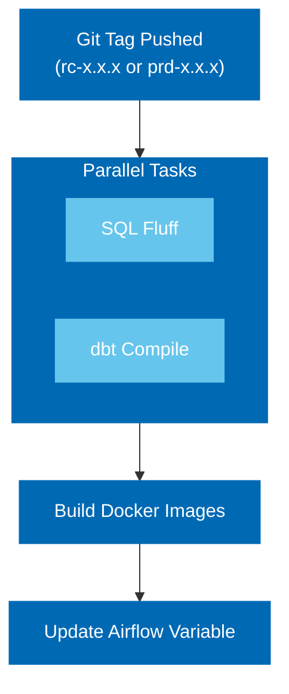
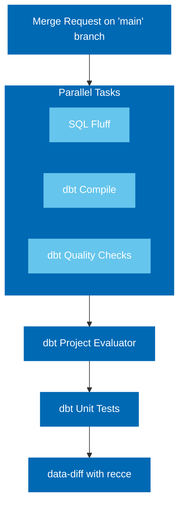

# dbt-training

## Overview

Welcome to the **dbt-training** repository! This project is designed as a playground for Astrafy Data Engineers and serves as a resource for workshops and training sessions.
&nbsp;
<details>
  <summary><strong>Installation Steps</strong></summary>

Follow the steps below to set up your environment:

1. **Create a Virtual Environment**
   ```bash
   pyenv virtualenv [PYTHON_VERSION_OF_YOUR_CHOICE] dbt-training
   ```
2. **Activate the Virtual Environment**
   ```bash
   pyenv activate dbt-training
   ```
3. **Install Poetry**
   ```bash
   pip3 install poetry
   ```
4. **Install Poetry Dependencies**
   ```bash
   poetry install
   ```
5. **Initialize Google Cloud (gcloud)**
   ```bash
   gcloud init
   ```
   - When prompted, select **Create a new Configuration**.
   - Enter a configuration name, for example: **astrafy-dbt-training**.
   - Follow the prompts to choose your email and enter the project ID (use the project ID provided in the slide).

6. **Activate the gcloud Configuration**
   ```bash
   gcloud config configurations activate astrafy-dbt-training
   ```
7. **Authenticate with Google Cloud**
   ```bash
   gcloud auth application-default login
   ```
8. **Set the DBT Profiles Directory**
   From the root of the repository, run:
   ```bash
   export DBT_PROFILES_DIR=$(pwd)
   ```
8. **Load the environment variables**
   From the root of the repository, run:
   ```bash
   source .env
   ```

---

You are now ready to run dbt commands!
</details>
&nbsp;
<details>
  <summary><strong>Get Started</strong></summary>

Once you have done the prerequisites:
- Initialize repository with cookiecutter
- Initialize infrastructure with Terraform
- Local installation steps

You are now ready to get started interacting with dbt and materialize your tables within BigQuery. Before getting started with 
dbt, you will need to ingest dummy data into your landing zone projects. Two python scripts are available in the "scripts"
folder and you have to run the scripts in this order:
```bash
-- Initialize BigQuery Dataset and tables within the Landing Zone project
python create_tables.py

-- Populate tables with dummy data
python generate_data.py
```
You now have data and can now navigate into the different dbt subfolders. Each dbt project subfolder contains a README 
as well as an exercise subfoler. Each dbt proejct covers different features and you should follow this order:

1. [customer](./dbt/customer/README.md)
2. [product](./dbt/product/README.md)
3. [transaction](./dbt/transaction/README.md)

There is also a dbt project named "all" as as explained in the [README](./dbt/all/README.md) of that project, its only
puprose is to import all dbt projects for dbt docmentation purpose.

</details>
&nbsp;

<details>
  <summary><strong>"How to" Build Docker Images</strong></summary>

This repository contains a `cloudbuild.yaml` yaml file that contains the different steps to dockerize the dbt code 
and push it to artifact registry.

By deploying the infrastructure module, you will have deployed a dedicated service account for Cloud Build with all necessary
permissions for training participants to use the Service Account and for this Service Accoutn to push images to the artifact 
registry repository located on the project "prj-astrafy-main-courses".

In order to build manually docker images for tdbt projects, users need to run from their terminal the following command 
at the root of the repository:
```bash

gcloud builds submit \   
  --config cloudbuild.yaml \
  --region=europe-west1 \
  --project prj-astrafy-main-courses \
  --service-account projects/prj-astrafy-artifacts/serviceAccounts/$SA_CLOUD_BUILD \
  --substitutions=_PACKAGE=<PACKAGE_NAME>,_COMPANY_NAME=$COMPANY_NAME,_VERSION=<VERSION>


EXAMPLE

gcloud builds submit \ 
  --config cloudbuild.yaml \
  --region=europe-west1 \
  --project prj-astrafy-main-courses \
  --service-account projects/prj-astrafy-main-courses/serviceAccounts/sa-cloud-build-slb@prj-astrafy-main-courses.iam.gserviceaccount.com \
  --substitutions=_PACKAGE=customer,_COMPANY_NAME=slb_l,_VERSION="1.0.0"

```
where you need to define the followign two variables:
- PACKAGE_NAME: package for which you want to build the image (customer,product,transaction)
- VERSION: a string version taht will be used as tag when pushing your image. 

The following two variables will be taken from the `.env` file. 
- COMPANY_NAME: name of the company for the training
- SA_CLOUD_BUILD: service account created in the infra course.

</details>
&nbsp;
<details>
  <summary><strong>"How to" use the CI with Github actions</strong></summary>
This repository utilizes GitHub Actions to automate Continuous Integration (CI) processes. Two pipelines are in place:

**Deployment Pipeline**

Triggered when git tags in the format rc-x.x.x or prd-x.x.x (where x.x.x follows semantic versioning) are pushed.



**Merge Request Pipeline**
Triggered whenever a merge request is created on the main branch.



</details>
&nbsp;


<details>
  <summary><strong>"How to" use the Airflow DAGs</strong></summary>
The Airflow directory contains the different DAGs that can be pasted in the GIT repository that is 
in sync with your Airflow instance. Airflow instance used for this training can be accessed via "https://airflow-training.astrafy.io".

In order to have a GIt directory in sync with this instance, follow instructions on this [notion documentation](https://www.notion.so/astrafy/Airflow-environments-1b72d630628880eb9a01d1c221d53e12?pvs=4#1b72d63062888082a9effcdfb1b3d41a)
and your DAGs will then appear on the Airflow UI.

All IAM bindings are managed through the infrastructure repository that will have deployed all necessary IAM bindings 
for Airflow to run your dbt DAGs.

</details>


&nbsp;

Happy training!
