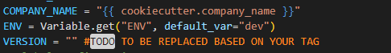
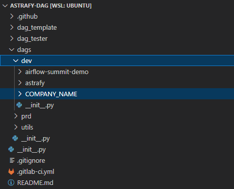

# Ariflow

## Overview

Welcome to the **dbt-training Airflow side**! If you are here it means that you want to use an orchestrator to harmonize your data journey from the data raw to insight from your business.

<details> <summary><strong>What is Airflow</strong></summary>
Really breathfly Apache Airflow is an open-source platform that allows users to programmatically author, schedule, and monitor complex workflows through Directed Acyclic Graphs (DAGs). The key components include:

* **DAG**: Defines the workflow, its structure, and dependencies between tasks.
* **Task**: Represents a specific operation or action; tasks are fundamental units executed within a DAG and define workflow logic.
* **Scheduler**: Manages the execution of tasks according to predefined schedules.
* **Webserver**: Offers an intuitive UI to monitor, trigger, and debug workflows and tasks.
* **Executor**: Runs the tasks, managing resource allocation and parallel execution.
* **Metadata Database**: Stores execution states, task statuses, and workflow history, providing persistence and auditability.
</details>

## Talking about DAG
**D**irect **A**cyclic **G**raph:
   
   * Direct: because it goes in one direction (left to right or top to bottom)
   * Acyclic: because you can not have cyclic dependencies between the Tasks of your worflow/data pipeline
   * Grpah: because it is represented using a graphical form.

   It is a python code that define dependencies of workflow between task. Each task has is own operation, based on the logic, and all of this is orchestrate by Airflow.

   Task is the implementation of an operator and there are many operators in Airflow and if yours is not there you can create your custom. [More documentation](https://airflow.apache.org/docs/apache-airflow/stable/core-concepts/operators.html)

   The DAG can be triggered in different way:
   * Manually: each dag has a play button in order to be executed manually 
   * Scheduled: using a specific time
   * Event trigger: based on an external trigger.
<details>
  <summary><strong>DAG at Astrafy</strong></summary>
  At Astrafy the DAGs are representing, what today is known a Data Product, which means a business use case in order to satisfy business needs that is completely indipendent. In the case of the following repository we have 3 different Data product
  
  1. Customer
  2. Product
  3. Transaction

  Each Data product what is going to do it is going to exploit Airflow features in order to run automatically his own data pipeline to deliver data business insihts running dbt.

  There are different way to run dbt in Airflow, and there are are different way as well of [installing](https://airflow.apache.org/docs/apache-airflow/stable/installation/index.html) Airflow.
  Since we are using our instance of Airflow that is installed in a Kubernetes cluster using Helm chart we are leveraging the kubernetes power to be more scalable and isolate using Pod to run each dbt trasnformation tasks.

  In order to so what we need is to have a Docker image, that needs to be pushed in an artifcat registry and it is used to refer and execute our dbt code. Basically we need something that is able to run in the same way that we do locally dbt.

  ### DAG Structure
   Each python file or simply DAG needs to reside in a folder, also know DAG folder or airflow home. In our use case is ```airflow-dags```
      > **💡 First thing first:**  
      > If you are here it means that you successfully build and push the image with the `gcloud build` command in the Artifact registry. In order to do so, you had to specifcy a version number like ```_VERSION="1.0.0"```. Please change the value in here  otherwise your dbt will fail.
   It is structured as per follow
   * Documentation: the first is part between quotes is the documentation related to the DAG itself that helps user to understand what is the logic of the DAG and if there are speicific requirements, rules and logic important to know
   * Imports: import of the python libraries used in your DAG
   * Constant and Global configuration: define constant variable and call defualt configuration in order to load the environment and get the values needed in the DAG.
   * Steps:
     * Ingestion: is calling a pre-built Astrafy's library `generate_and_load(rows_per_table, bq_project,bq_dataset,data_product)` that is going to ingest data in BigQuery for a specific data_product (customer, product, transformation) based on the number of rows indicated (default 50).
     * Transformation: running dbt within KubernetesPodOperator with the image build with cloud build for the specific data product.
     * Distribuition: sending a PubSub message to simulate the notification to the downstream application.
   #### KubernetesPodOperator
   The KubernetesPodOperato as explained above is the main player here thatt basically is running our dbt commands: `dbt run`/`dbt build`/`dbt tests`

   **dbt_run_stg/dbt_run_test**
   If you remember while testing the different dbt packages you used to run dbt based on selector/tags like `dbt build --select tag:customer` or more granular `dbt run --select tag:stg__customer`. The idea is that using KubernetesPodOperator we are simulating the same behavior.

   In this case the `dbt_run_stg` will run the staging layer of your specific data product, while `dbt_run_test` will run the dbt test of it.

   **Last touch:**  After that you understood what the DAG is doing you do not need to do anything else than copy tour DAG (python files) in this [folder](https://gitlab.com/a8042/data-analytics/astrafy-dag/-/tree/main/dags/dev?ref_type=heads) and a new folder called with the name of the company/training/course and do a git commit and git push and the dag it will appear in Airflow. Like per image below.
   
   This is done in order to have dags separation.
   After that is done the last thing that you need to do is going to the Airflow UI and a Variable (a key,value pair) like:
   * Key: `{DATA_PRODUCT}_{COMPANY_NAME}_-_VERSION` (e.g CUSTOMER-SLB-L_VERSION **NOTE: COMPANY MUST CONTAINS DASHES AND NOT UNDERSCORE**)
   * Value: `{VERSION}` (e.g 1.0.0)
      

   > **💡 Side Note:**  
> There is no a real best practice in how to structure your DAG except from the fact that the code should be as much as possible parametrized, cleaned and readable. But despite from that the way that you run your dbt task is up to your choice. Personally, we think that have a separation between different layers is logical to have like that if the pipeline is failing you could see which is the problematic layer, check the logs and re-execute only that specific stage.


   

</details>